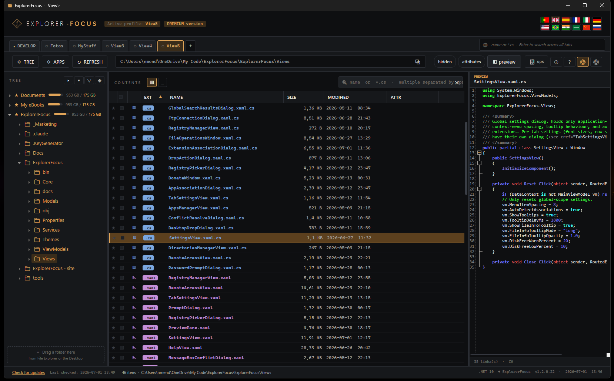

# ExplorerFocus

**A distraction-free file explorer for Windows 10 & 11.**
Profiles, rich preview, honest file operations, remote/cloud access — and capture tools built in.

[**⬇ Download (.exe)**](https://github.com/NuneX-mBrothers/ExplorerFocus/releases/latest/download/ExplorerFocus.exe) · [**Download (.zip)**](https://github.com/NuneX-mBrothers/ExplorerFocus/releases/latest/download/ExplorerFocus.zip) · [**Website**](https://nunex-mbrothers.github.io/ExplorerFocus/) · [**Releases**](https://github.com/NuneX-mBrothers/ExplorerFocus/releases/latest)

Single `.exe` · no installer · no runtime to install · 12 languages

---

## Why

Windows Explorer treats every folder the same: one window trying to do everything, remembering
nothing. ExplorerFocus is built for people who spend the day in the same handful of folders and
want to reach them fast — and to see what's inside a file without opening it.

## What it does

- **Profiles** — each is a tab with its own folder tree, filters and remembered state. `Ctrl+1`–`9` to switch.
- **Configurable trees** — build them from folders *and* from registry roots; drag to reorder. Disk space shown per root.
- **Multi-pattern search** — `*.cs *.json` in one box, wildcards anywhere, plus opt-in search across profiles.
- **Rich preview** — code with syntax highlighting and folding, Markdown, PDF, Word/Excel/PowerPoint, images, EPUB, audio and video (streamed, so a 2 GB file opens instantly).
- **Honest file operations** — copy/move/delete with real per-file progress, throughput, ETA, pause/resume, up to 6 in parallel, persistent history and 6-way conflict resolution.
- **Remote & cloud** — SFTP, FTP/FTPS, WebDAV, Dropbox, OneDrive. Browse, preview and operate as if local; edit a remote file and it syncs on save.
- **Capture built in** — screen (with webcam PiP and system audio), video, audio and scanning, without leaving the explorer.
- **Complete dark theme**, rich hover tooltips, archives browsable as folders, integrated terminals (CMD, PowerShell, Git Bash), per-extension app associations, auto-updates.

## Free vs Premium

**The free version is the complete product for virtually everyone** — all the file management,
profiles, preview, operations, terminals, dark theme and the 12 languages. Nothing expires,
nothing nags.

Premium unlocks a handful of specific, fairly technical extras: multiple simultaneous remote
connections, screen capture without watermark or time cap, multi-page scanning with a document
feeder, and the full EPUB reader. It's a **one-time donation**, not a subscription, activated per
machine. Details on the [website](https://nunex-mbrothers.github.io/ExplorerFocus/#premium).

## First run

The executable isn't code-signed yet, so Windows SmartScreen may warn on first launch.
Click **More info → Run anyway**. Every release publishes its **SHA-256** in
[`version.json`](version.json) and on the website, so you can verify the file you downloaded.

## Built with

WPF on .NET 10, published as a single-file self-contained `win-x64` executable.
AvalonEdit (code preview) · WebView2 (PDF/Office/Markdown) · SSH.NET · FluentFTP · Media Foundation (capture).

## About

Made by **mBrothers** — three brothers who keep talking each other into building things.
Questions, bugs and ideas: [NunexmBrothers@gmail.com](mailto:NunexmBrothers@gmail.com)

Also from us: [**The Absolute LogViewer**](https://nunex-mbrothers.github.io/TheAbsoluteLogViewer/) — a free Windows log viewer with real-time tailing.
